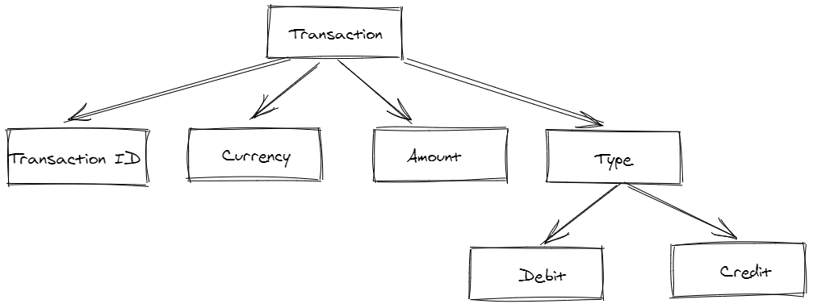

# My Wallet App Installation

```bash
git clone https://github.com/tmoran18/wallet-manager.git
cd my-wallet
yarn install
yarn start
```

## Approach / Reasonings

The DoseMe repositories style of writing React and inclusion of TypeScript threw me off a little at first.<br>I am confident I could pick both up, but time was a factor. Instead I used Create React App, and coded in my current React style using hooks. I used Context API also, but ended up with very little global state. The app does not currently persist user data.

My first objective was to get an idea of what the data structure would look like.


<br>
<br>
I then started on the add transaction component. I decided to keep the business logic with the component to save having to pass props around.

I decided to go with a form style to add/update transactions. I probably spent a little longer than I would have liked on the form. Controlled inputs<br>can be a little tedious. I hadn't had to deal with controlled selects & options dropdowns yet so that was interesting. If doing a bigger project I think reaching for a library such as formik would be<br>advantageous.

I believe I met 4 out of the 5 User stories. Deleting all transactions for a specific currency was the one I did not get around to.

## Challenges / What could be done better
- The Add Transaction / Update Transaction components share logic & code. If I had time this would be refactored / abstracted away.
- The UI is very basic - would be refined. A real App would be much more than just a list.
- My CSS needs refactoring. I just did what I needed to meet the time-frame.
- The group by currency function/UI does currently sort the currency, but I would visually group these in a better way once I could come up with a better solution.
- I had to research Stackoverflow a bit to find an array sort function that would work for me. I have referenced the user/page in the code comments.
<br>
<br>


